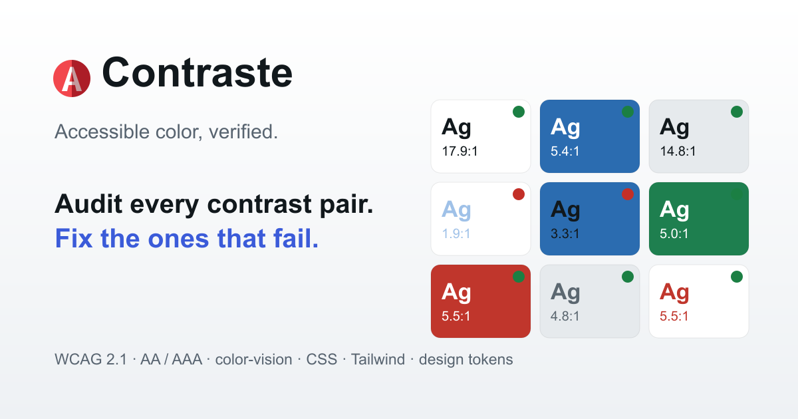

# Contraste

**Accessible color, verified.** A WCAG 2.1 contrast auditor for design-system palettes: see every text-on-background pair at once, get one-click accessible fixes, preview color-vision deficiencies, and export the result as design tokens.

🔗 **Live:** https://get-contraste.vercel.app · Built by [Kevin Heineman](https://www.kevinheineman.com/)



---

## Why

Most contrast checkers test one pair at a time. Real palettes have _n²_ pairs, and the question is rarely "does black pass on white" — it's "which of my brand colors can I actually put on which surfaces, and if a combination fails, what's the smallest change that fixes it?" Contraste answers that across the whole palette, then hands you tokens you can paste straight into a codebase.

## Features

- **Contrast matrix** — every foreground × background pair with its exact contrast and pass-fail flags. The sample text is rendered _in the actual colors_, so you see legibility, not just a number.
- **Two algorithms** — switch between **WCAG 2.1** ratios (AA, AAA, and the 3:1 UI threshold) and **APCA** — the perceptual-lightness method (Lc) that is the candidate for WCAG 3. WCAG 2's ratio misjudges plenty of pairs, especially on dark UI; APCA is surfaced as a labelled preview. (**Section 508** adopts WCAG 2.0 AA, so it's the same 4.5:1 bar — the inspector notes this rather than duplicating it as a level.)
- **Pair inspector** — select any cell for a live UI preview and the full conformance checklist for the active algorithm.
- **Nearest accessible fix** — when a pair fails, Contraste searches OKLCH lightness for the _smallest_ change to either color that clears AA, preserving hue and chroma. One click applies it.
- **Vision simulation with severity** — preview protan / deutan / tritan deficiency with a **0–100% severity slider** (most color-blind people are partial, not fully dichromatic), plus an **achromatopsia / grayscale** mode.
- **Distinguishability check** — beyond contrast: flags palette colors that collapse to near-identical under the active deficiency — the thing that breaks chart series and red/green status colors.
- **Low-vision preview** — a blur + reduced-contrast lens on the inspector sample, for reduced acuity.
- **Export** — CSS custom properties, a Tailwind color config, [W3C design tokens](https://www.designtokens.org/), or a machine-readable contrast report (with APCA Lc) you can diff in CI.
- **Shareable** — the whole palette lives in the URL, so any palette is a link.
- **Accessible by construction** — held to WCAG AA in both light and dark themes, with visible focus, status conveyed by icon + text (never color alone), and `prefers-reduced-motion` respected.

## How the contrast is computed

Ratios use the WCAG 2.1 relative-luminance definition — sRGB channels linearized with the `0.03928` threshold, weighted `0.2126 / 0.7152 / 0.0722`, combined as `(L₁ + 0.05) / (L₂ + 0.05)`. This matches [WebAIM's Contrast Checker](https://webaim.org/resources/contrastchecker/) to the decimal, so the numbers are the ones your auditors will quote.

**APCA** is implemented from the public [APCA-W3](https://github.com/Myndex/apca-w3) constants and unit-tested against its reference values (black-on-white `Lc 106`, white-on-black `Lc −108`).

The "nearest accessible fix" works in a different space — [OKLab / OKLCH](https://bottosson.github.io/posts/oklab/) — because perceptual uniformity makes "change the color as little as possible" meaningful. The two color pipelines deliberately use different sRGB linearizations (WCAG's `0.03928` vs. the sRGB-standard `0.04045`); the reasoning is documented in [`src/lib/color.js`](src/lib/color.js).

All of it is hand-written with **zero runtime color dependencies** and covered by unit tests against known values (black/white = 21:1, the canonical lightest AA-passing grey, OKLCH round-trips, fix convergence).

## Prior art & credits

- The contrast-matrix concept is owed to [EightShapes Contrast Grid](https://contrast-grid.eightshapes.com/) by Nathan Curtis. Contraste adds the pair inspector, the accessible-fix solver, the two-algorithm toggle, vision simulation, and token export.
- Dichromacy simulation uses the linear-RGB matrices of Viénot, Brettel & Mollon (1999); severity blends from normal vision toward full dichromacy (exact at both ends, an approximation between — not a per-severity physiological model). For design review, not a clinical tool.
- APCA by Andrew Somers / [Myndex Research](https://github.com/Myndex/apca-w3) — a draft method that may change.

## Tech

React 18 · Vite · Vitest · plain CSS with custom-property theming. No UI framework, no color library.

## Getting started

```bash
npm install
npm run dev        # start the dev server
npm test           # run the contrast/color unit tests
npm run build      # production build to dist/
```

### Regenerating icons & social image

Favicon and OG assets are generated from [`public/favicon.svg`](public/favicon.svg) so nothing binary needs hand-editing. `sharp` is installed transiently to keep it out of the dependency tree:

```bash
npm install --no-save sharp
node scripts/generate-assets.mjs
```

## Project structure

```
src/
  lib/                 # framework-free core (unit-tested)
    color.js           # hex parsing, sRGB ⇄ OKLab/OKLCH
    contrast.js        # WCAG relative luminance, ratio, thresholds
    fix.js             # nearest-accessible-color search
    colorblind.js      # CVD simulation
    exporters.js       # CSS / Tailwind / tokens / report
    url.js             # shareable palette state
  components/          # presentational React components
  App.jsx              # state + composition
```

## License

[MIT](LICENSE) © Kevin Heineman
